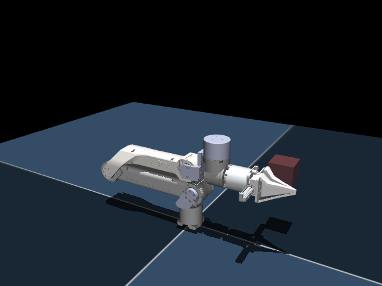

# ARX X5A 模型描述（MJCF）

需要 MuJoCo 2.3.3 或更高版本（支持 STL 网格）。

## 概述

本包包含 **ARX X5A** 机械臂的机器人模型描述（MJCF），由 SolidWorks 导出的 URDF
描述转换而来。

<p float="left">
  
</p>

该模型自包含且可迁移：MuJoCo XML 文件通过相对路径引用网格资源（参见
`<compiler meshdir="assets">`），因此整个 `arx_x5a` 文件夹可以移动到或复制到任意
位置，仍然可以正常加载。

## 目录结构

```
arx_x5a/
├── x5a.xml       # MuJoCo 模型：运动学、惯量、执行器、关键帧
├── scene.xml     # 示例场景：地面、灯光、mocap 目标点
├── assets/       # 模型引用的 STL 网格
├── README.md
└── LICENSE
```

## 模型概要

| 项目       | 值                                  |
|------------|-------------------------------------|
| 自由度     | 8（6 个旋转 + 2 个平移）             |
| 连杆       | base_link + link1 … link8            |
| 关节       | joint1 … joint8                      |
| 夹爪       | joint7 / joint8（平行手指）          |
| 执行器     | 8 个位置伺服（每个关节一个）         |

### 关节轴向与范围

| 关节   | 类型      | 轴向   | 范围（rad / m） |
|--------|-----------|--------|-----------------|
| joint1 | revolute  | 0 0 1  | -10 … 10        |
| joint2 | revolute  | 0 1 0  | -10 … 10        |
| joint3 | revolute  | 0 1 0  | -10 … 10        |
| joint4 | revolute  | 0 1 0  | -10 … 10        |
| joint5 | revolute  | 0 0 1  | -10 … 10        |
| joint6 | revolute  | 1 0 0  | -10 … 10        |
| joint7 | prismatic | 0 1 0  | 0 … 0.044       |
| joint8 | prismatic | 0 -1 0 | 0 … 0.044       |

> 旋转关节的范围（-10 … 10 rad）是直接从源 URDF 原样保留的，源文件导出的
> 是宽松的占位限位。如有需要，请按真实硬件限位收紧。

## URDF → MJCF 转换步骤

1. 读取 SolidWorks 导出的 URDF（`X5A.urdf`）—— 9 个连杆、8 个关节。
2. 将每个 URDF 连杆/关节直接映射到 MuJoCo 的 body/joint：
   - 关节 `origin`（`xyz` + `rpy`）→ body 的 `pos` + `euler`；
   - 关节 `axis` → joint 的 `axis`；
   - 连杆 `inertial`（`mass`、`origin`、6 分量惯量）→ body 的
     `<inertial>`（含 `mass`、`pos` 与 `fullinertia`）；
   - 连杆 `visual` 网格 → 每个连杆一个 `<geom type="mesh">`（仅视觉，`contype="0"`）。
3. 将引用的 STL 网格复制到 `assets/`，并将 `package://X5A/meshes/...` 路径
   改为相对的 `meshdir="assets"` 引用。
4. 添加位置控制执行器（每个关节一个）以及 `home` 关键帧。
5. 为每个连杆添加碰撞几何体（group 3 的盒子/胶囊），并为相邻连杆添加
   `<contact><exclude>` 排除对。
6. 添加 `scene.xml`，其中包含机器人以及带纹理的地面、灯光和 mocap 目标点。

> **碰撞说明。** 每个连杆都带有一个（或两个）碰撞几何体（group 3，半透明盒子/胶囊），
> 由 STL 截面尺寸近似得到（而非包围盒）：长臂（link2/link3）使用沿梁轴方向的
> 胶囊/盒子，腕部支架（link6）拆分为轴与手指支架两个盒子。视觉网格仍为
> `contype="0" conaffinity="0"`（仅视觉，不参与碰撞）。
>
> 相邻连杆在关节处物理上共用一个连接座，因此通过 `<contact><exclude>` 从自碰撞中
> 排除（`base_link↔link1`、`link1↔link2`、…、`link6↔link7`、`link6↔link8`、
> `link7↔link8`）。home 位姿（全零）无自碰撞；在较大关节角下，非相邻连杆会真实地
> 折叠并发生接触，此时会正常检测到碰撞。

## 用法

```python
import mujoco

model = mujoco.MjModel.from_xml_path("x5a.xml")
data  = mujoco.MjData(model)

# 将所有关节移动到目标构型
data.ctrl[:] = [0, 0.5, -1.0, 0.3, 0, 0, 0.02, 0.02]

while data.time < 5:
    mujoco.mj_step(model, data)
```

或者加载独立场景（添加了地面和灯光）：

```python
model = mujoco.MjModel.from_xml_path("scene.xml")
```

## 许可证

本模型基于 [BSD-3-Clause 许可证](LICENSE) 发布。
